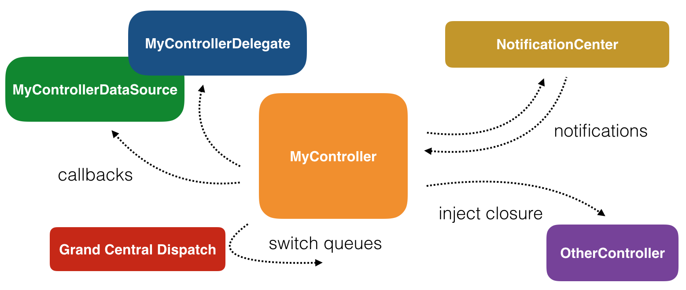

# Hello RxSwift

### RxSwift 란 뭔가?

- RxSwift is a library for composing asynchronous and event-based code by using observable sequences and functional style operators, allowing for parameterized execution via schedulers.
- RxSwift 는 옵저버블 시퀀스와 함수 스타일 연산자를 사용하여 비동기 및 이벤트 기반 코드를 구성하도록 도와주는 라이브러리 이며, 스케쥴러를 통해서 매개변수화 된 실행을 가능하게 한다.
- 본질적으로 새로운 데이터에 반응하고 순차적으로 격리된 방식으로 처리할 수 있도록 하여 비동기 프로그램 개발을 단순화 한다.

### 비동기 프로그래밍

- 단순하게 아래 리스트중 무엇이든 혹은 더 많은 것을 하는 것이다.
  - 버튼 탭에 반응하는것
  - 텍스트 필드가 focus 를 잃었을 때 애니메이션 처리
  - 인터넷에서 큰 사진을 다운로드 하는 것
  - 오디오 재생 
  - 등등...
- 자신의 프로그램의 모든 서로 다른 부분들이 실행에 대해서 서로에게 block시키지 않는 것이다.

### Cocoa & UIKit 비동기 API

- Apple에서 제공하는 비동기를 도와주는 대표적인 API는 다음과 같다.

  - NotificationCenter : 
    - 어떤 관심 있는 이벤트가 발생 했을 때 언제든 코드를 실행 할 수 있게끔 하는 것 
    - 예를 들어 화면의 방향 전환 및 키보드 보여주는 이벤트를 캐치할 수 있다.
  - Delegate Pattern
    - 어떤 객체에 대한 행동을 대표해주는 객체를 정의하는 것

  - GCD ( Grand Centeral Dispatch )
    - 작업의 실행을 추상화 할 수 있도록 도와주는 것
    - 코드의 실행 계획을 세울 수 있다. ( 예를 들어 serial Queue 혹은 concurrent on diffrent Queue & priorities 등을 활용한다.)
  - Closures
    - 코드를 전달하기 위해서 코드의 일부분을 떼어내는 것

- 애플에서 제공하는 API들은 굉장히 강력하다 하지만 애플에서 다양한 API를 제공해 줌으로써 쓰기 복잡할 수도 있다.

  

### 동기 코드

