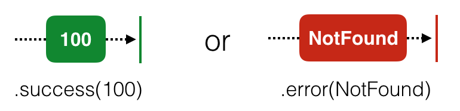
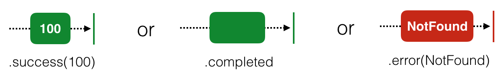
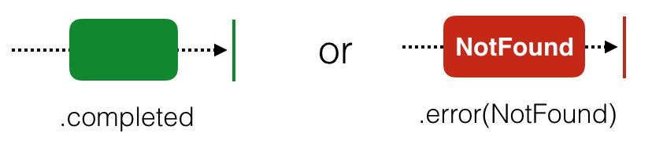

# ch4 Observable & Subjects in practice

- observable과 subject의 차이점에 대해서 제대로 알아보자

## Using a subject in a view controller 

- disposebag을 사용함으로 인해서 viewcontroller가 해제 되었을 때, all observable subscription 이 dispose 될 것이다. 굉장히 심플하다. 하지만 rootviewcontroller와 같은 VC는 원하는 대로 작동하지 않을 수도 있다. 이와 관련해서는 추후에 다룰 것이다.
- accept(_)
  - 구독자에게 업데이트된 값을 전달하기 위해서 사용한다. 이를 통해서 .next 이벤트가 발생할 것이다.

#### Adding photos to the collage

- subject이지만 Observable 의 subClass이기 때문에 직접적으로 구독이 가능하다.
- 항상 dispoebag에 제대로 담아 놓았는지 확인하자.
- subject.subscribe 를 통해서 업데이트 로직을 클로저에 담아놓자.
  - 이 때 subscribe(onNext : {}) 를 사용하여 값이 들어오는 것을 쉽게 확인할 수 있도록 하자
  - subject는 단순히 accept 를 통해서 값을 받아들이고, 방출하는 역할만 한다. 에러나 종료는 처리하지 않지만 subscribe에서는 다른 이벤트도 받을 수 있다고 판단하기 때문에 `subject.subscribe(onNext:  {})` 를 활용하자

#### Talking to other view controllers via subjects

- 만약 cocoa pattern 으로 앱을 만든다면 delegate를 만들고 이를 연결 해줘야 할 것이다. 하지만 이 방법은 non-reactive way이다.
- 하지만 RxSwift에서는 Observable 을 통해서 두개의 클래스 사이에 대화를 할 수 있다.
  - Observable은 어떠한 종류의 메세지도 담을 수 있고 어느 구독자에게나 전달할 수 있기 때문이다.

#### Creatng an observable out of the selected photos

- push 된 Photos View Controller 에서 subject를 추가하자.
  - 예제에서는 Publish Subject 그리고 Observable 을 선언했다. ( Observable 은 Subject.asObservable() 사용 ) 왜 그랬을까?
    - 아마도 캡슐화. 즉 일부의 접근을 제한하려는 의도라고 생각한다. ( 선택 된 사진들을 조작하지 못하도록 )
- 이 Observable을 통해서 접근할 수 있고, 이를 통해서 delegate를 없앨 수 있다. 관계가 굉장히 단순해지므로 기억해두자

#### Observing the sequence of selected photos

- 관찰하고자 하는 부분에서 Observable을 참조하여, subscribe를 한다. 그리고 disposed 또한 제대로 실행이 되는 지 확인해보자

#### Disposing subscriptions

- 예제대로 진행한다면 dispose 가 제대로 되지 않을 것이다. 그 이유는 사라지는 viewcontroller 에서 disposebag을 연결하지 않았기 때문이다.
  - Observable이 있는 ViewController의 disposeBag을 사용해야 한다는 사실을 잊지 말자
  - 혹은 VC가 사라질 때 completed event 를 내보내자 자동으로 dispose될 것이다.

## Creating a custom observable

- 자신만의 Observable 을 만들 수 있다. 이를 통해서 apple api를 reactive 한 class 로 변경해 볼 것이다.

#### Wrapping an existing API

- 간단하게 API 가 성공한다면 .next 와 .completed 를 보내면 되고, 에러가 발생하면 custom Error 를 보내면 된다.
- 마지막으로 return Disposables.create()를 통해서 Observable 이 제대로 리턴되도록 해주자 

##### 궁금한 점 > 왜 Observable일까???

### RxSwift traits in practice

- 특정한 상황에서 굉장히 편리한 traits를 배웠다. 한번 간단하게 리뷰를 해보자

#### Single

- .success(value) 혹은 .error 를 한번만 방출하는 sequence 이다.
  - 그리고 사실상 .success 라 하면 .next + .completed 의 쌍이다.
- 보통 대부분의 비동기 작업에 잘 어울리며, 두가지의 use-case 를 생각 해볼 수 있다.
  1. 성공했을 경우 하나의 element만 방출하는 기능을 wrapping 하는 목적으로 사용할 수 있다.
  2. 의도적으로 하나의 element만 받는 것을 말할 때, 예를 들어 여러개의 next가 들어온다면 error를 방출할 수도 있다.
- 따라서 이러한 경우에 single 을 사용하고 싶다면 .asSingle() 을 사용하면 된다.

#### Maybe

- single과 굉장히 비슷하다. 단지 다른점 하나는 completed 당시에 value 를 갖고 있지 않을 수도 있다는 점이다.
- 한마디로 의도된 대로 동작하여 성공한경우, 제대로 동작은 하였지만 의도치 않은 결과가 나오는 경우, 에러가 발생하는 경우 이렇게 나뉠 수 있다.
- 다른 traits 와 동일하게 직접 create 를 할수도 있고, Observable에 .asMaybe를 할수도 있다.

#### Completable

- 단순히 .completed 혹은 .error 를 한번만 방출한다.
- Observable sequence 를 .ignoreElements() 를 통해서 만들 수 있다. 이 경우 모든 next 가 무시된다.

- auto-save 가 가능한 document tool을 만든다고 하면 굉장히 유용하게 쓰일 수 있다.
  - 예제에서 사용한 andThen 의 경우 성공 이벤트에 더 많은 Compatables 혹은 Observables를 연결할 수 있다. 

### Challenges

- later

