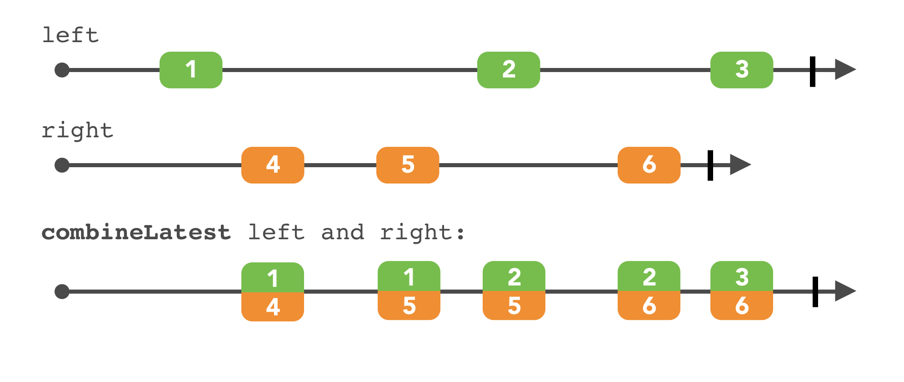
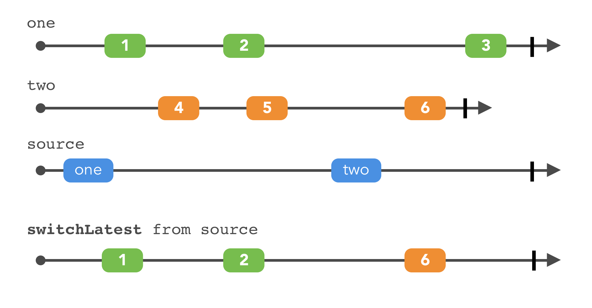

# CH9 Combining Operators

- 이번 챕터에서는 sequence들을 조합하는 다른 방법들을 보여줄 것이고, 각 sequence 안에서 data들을 합치는지 보여줄 것이다.

### Prefixing and concatenating

- Observable 을 사용하면서 가장 애매한 필요함은 옵저버가 초기값을 받는지 보장하는 것이다.
  - 현재 값을 처음 값으로 사용하고 싶은 상황이 있을 것이다. 예를 들어서 현재 위치에 대한 Observable
- startWith 라는 operator를 통해서 초기 값을 설정해줄 수 있다. ( 실제로는 아니지만 맨 처음에 값을 받은 것 처럼 )
  - .next 내부에 2 3 4 를 가지고 있는 Observable 이 있을 때에도 startWith을 통해서 1 2 3 4 가 있던 것 처럼 사용할 수 있다
- 사실 startWith는 concat의 family 라고 할 수 있다. swift에서와 동일하게 concat을 사용하여 두개의 sequences 를 합칠 수 있다. 
  - startWith의 경우에는 Single과 Observable 을 합친 것이라고 표현할 수 있을 것이다.
- concat의 경우 순서를 유의해서 작성을 해야 하며 첫번째 sequence가 종료될때 까지 기다리고 있는다. 즉 source sequences들이 모두 종료된 이후에 합칠 수 있다.
  - 또한 내부에서 에러를 방출한 경우에는 concat 된 Observable 또한 error 를 방출하고 종료된다.
- 마지막으로 concatMap을 살펴보자 이 operator는 flatMap 과 관련이 있다. 각각의 sequence 가 순차적으로 종료 된다는 것을 보장한다.

### Merging

- 여러개의 sequence를 합치는 가장 간단한 방법이다.
- merge()를 하게 된다면 하나 sequence에서 각각의 sequence를 구독하게 되고 이벤트를 받을 수 있다.
- merge 된 sequence의 종료 되는 시점은 다음과 같다.
  1. source sequence가 종료 되고, 모든 내부의 sequence 가 종료 되었을 때 ( 이때 내부 sequence 들의 종료 순서는 상관이 없다.)
  2. inner sequences 중 하나라도 error event를 받은 경우 그대로 전달이 되서 종료된다.

### Combining elements

- combineLatest operator



- 두개의 A , B sequence가 있다고 하자, A 에서 1을 받고 B에서 2를 받은 경우 1,2를 받는다.
  - 이때 A에서 3을 받았다면 3,2 를 받는다.
  - 이렇게 들어온 값이 교체되어 방출을 하는 방식이다.
- 자주 쓰이는 방식으로 예를 들어서 여러개의 필드에 입력 form을 받을 때 하나의 필드가 변경이 되더라도 간단하게 대응할 수 있는 코드를 작성할 수 있다.
- 혹은 유저의 설정에 따라서 UI 를 업데이트 하는 경우 수동적으로 하는 코드를 없앨 수 있다.
- a few points
  - combine은 closure 를 사용해서 어떻게 받을지 설정할 수 있다. 예를 들어서 string 2개를 받으면 두개를 합칠 수도 있고 따로 받을 수도 있다. 
  - 여러개의 sequence가 있다면 각각 적어도 하나의 .next를 방출하기 전 까지는 값을 받지 않는다. 그 이후에 값을 받으면 최신 값으로 대치가 되어 이벤트가 전달된다.
  - 추가로 그렇기 때문에 startWith(_:)를 사용하면 좋은 효과를 기대할 수 있다.
- 비슷하게 zip operator를 사용할 수 있다.


- zip의 역할은 다음과 같다.
  - 제공된 observable 들을 구독한다.
  - 각각에서 새로운 값들이 들어오기를 기다린다.
  - 모든 observable 이 들어 왔을때 클로저를 호출한다.

### Triggers

- withLatestFrom(_:)을 사용하면 UI 관련해서 굉장히 유용할 것이다.
  - button 과 string 두개의 필드가 있을 때 button.withLatestFrom(string) 을 사용하면 버튼이 눌렸을 당시에 가장 최신의 string 값을 확인한다.


- sample(_:)를 사용하면 최신 값을 가져오는데 만약 값이 변경되지 않았다면 버튼을 누르더라도 sample에 연결될 closure 는 호출 되지 않는다.
  - 이 operator는 distinctUntilChanged() + withLatesFrom(_:)을 합친 것이다. 그리고 이렇게 간단하게 사용하는 것이 Rx의 미덕이다.
  - 이는 UI에 굉장히 유용하게 사용할 수 있다.


### Switches

- RxSwift는 두개의 주요한 switching operator로 다가 온다.
  1. amb(_:)
  2. switchLatest()
- 이는 둘다 런타임시에 구독하는 observable 을 변경하는 것이라고 할 수 있다.
- amb(_:)
  - 애매한 경우에 사용한다 예를 들어서 두개의 Obsevable중에서 어떤 Observable을 써야 할지 모르겠는 경우
  - A B 두개의 Observable 을 구독한 뒤 만약 하나의 Observable에서 event가 들어온다면 나머지 하나는 구독을 취소한다. 즉 처음으로  active 되는 observable만 구독한다. 


- switchLatest()

  - amb보다 조금 더 자주 쓰인다.

  - 여러개의 Observable이 있는 경우 구독할 타겟을 변경할 수 있다.



### Combining elements within a sequence

- Swift에 있는 reduce와 동일하다.
  - 이렇게 계산이 끝나면 observable이 종료가 된다.

```swift
// original version
let observable = source.reduce(0, accumulator: +)
  _ = observable.subscribe(onNext: { value in
    print(value)
  })
}

// short version
let observable = source.reduce(0) { summary, newValue in
    return summary + newValue
}
```

- scan 이라는 operator가 있다. 앞에서 나온 값들을 하나로 축약하는 것은 동일하다. 단 끝나지 않고 값이 추가될 때 마다 다시 계산을 한다.

